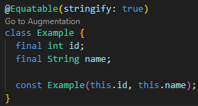
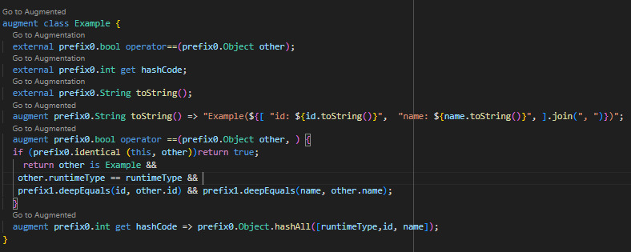

<!-- Pre-release Version: -->
<!-- README-main.md -->


# equatable_macro (Pre-release: 0.0.1-main.1)

A Dart package providing a macro to automatically make classes equatable, inspired by the [`equatable`](https://pub.dev/packages/equatable) package. This is a pre-release version and may contain experimental features.

## Features

- Automatically implements equality and hashCode for your classes.
- Easy to use with minimal boilerplate.
- Generates a `toString` method to provide a string representation of your objects.

## Installation

Add the following to your `pubspec.yaml`:

```yaml
dependencies:
  equatable_macro: ^0.0.1-main.1
```

Add the following to your `analysis_options.yaml`:

```yaml
analyzer:
  enable-experiment:
    - macros
```

## Usage
Import the package and use the `@Equatable()` annotation:
```dart
import 'package:equatable_macro/equatable_macro.dart';

@Equatable() //or @Equatable(stringify: true)
class Example {
  final int id;
  final String name;

  const Example(this.id, this.name);
}

```
## Example
```dart
// lib/main.dart
import 'package:equatable_macro/equatable_macro.dart';

void main() {
  var a = Example(1, 'a');
  var b = Example(1, 'a');
  var c = Example(2, 'b');

  print(a == b); // true
  print(a == c); // false
}

@Equatable() //or @Equatable(stringify: true)
class Example {
  final int id;
  final String name;

  const Example(this.id, this.name);
}

```
## Run
```bash
dart --enable-experiment=macros run lib/main.dart
```

| @Equatable(stringify: true) macro applied to a class | Demonstration of the @Equatable(stringify: true) macro in use|
|---|---|
|  |  |


## Benchmarks

Benchmarks for this package are yet to be added. Stay tuned for updates.

## Special Thanks

- Remi Rousselet : [@rrousselGit](https://github.com/rrousselGit)
- Felix Angelov : [@felangel](https://github.com/felangel)
- Simon Lightfoot: [@slightfoot](https://github.com/slightfoot)
- Dane Mackier: [@FilledStacks](https://github.com/FilledStacks)


## Contributing
Contributions are welcome! Please submit pull requests or create issues for any improvements or bugs you find.

[Github Repo](https://github.com/antinna/equatable_macro)

## Sponsor
If you find this project helpful, consider sponsoring it on GitHub:

[Github Sponsor](https://github.com/sponsors/Manishmg3994)


Follow on YouTube
For more tutorials and project walkthroughs, subscribe to our YouTube channel:

[@Antinna YouTube Channel](https://m.youtube.com/antinna)

---
Maintained by [Manish Gautam](https://github.com/Manishmg3994)

---

---
Powered By [Antinna](https://github.com/antinna)